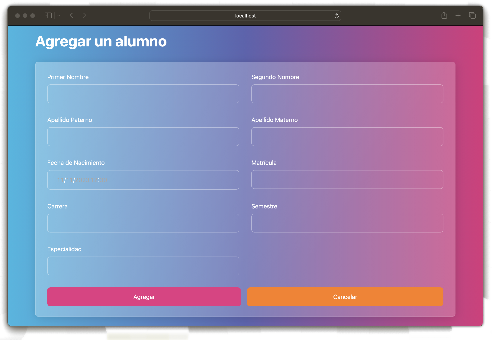

# CRUD con ASP.NETCore y MySQL
CRUD básico creado con ASP.NET Core MVC y MySQL. Permite visualizar, crear editar y eliminar alumnos e instructores. La aplicación puede encriptar y desencriptar datos con el algoritmo AES. En este ejemplo, solo el primer nombre es encriptado/desencriptado.


Este es un test sencillo de un CRUD en ASP.NET Core y usando MySQL para la base de datos.
El software fue desarrollado en Jetbrains Rider, MySQL en Docker(8.0.32) y phpMyAdmin(5.2.1). Sistema Operativo: Mac OS Ventura 13.6.

El link **Alumnos** muestra la unión entre la tabla `alumno` y `persona`. El link **Instructores** muestra la unión entre la tabla `instructor` y `persona`.
La tabla `persona` contiene los datos comunes para una persona, como sus nombres y apellidos.
El link **Reuniones** muestra la unión entre las tablas `persona`, `alumno`, `alumno_reunion` y `reunion`.



<details>
<summary>Dependencias</summary>
  Se requiere de las siguientes dependencias:
  
  - Microsoft.EntityFrameworkCore.Tools
  - MySql.Data
  - MySqlConnector
</details>

<details>
  <summary>Base de datos</summary>
  
  Los datos iniciales de la base de datos son incluidos en el script. El primer nombre de cada persona está ya encriptado.
  
  ```sql
  CREATE DATABASE `practica_cSharp`;

  USE `practica_cSharp`;
  
  CREATE TABLE `alumno` (
  `id_persona` int UNSIGNED NOT NULL,
  `matricula` varchar(64) NOT NULL,
  `semestre` varchar(64) NOT NULL,
  `especialidad` varchar(64) NOT NULL
  );
  
  INSERT INTO `alumno` (`id_persona`, `matricula`, `semestre`, `especialidad`) VALUES
  (2, 'A12345', '3', 'Ingeniería Civil'),
  (4, 'B67890', '2', 'Medicina'),
  (6, 'C54321', '4', 'Derecho'),
  (8, 'D98765', '5', 'Economía'),
  (10, 'E23456', '2', 'Psicología');
  
  CREATE TABLE `alumno_reunion` (
  `id_alumno` int UNSIGNED NOT NULL,
  `id_reunion` int UNSIGNED NOT NULL
  );
  
  INSERT INTO `alumno_reunion` (`id_alumno`, `id_reunion`) VALUES
  (2, 1),
  (4, 2),
  (6, 3),
  (8, 4);
  
  CREATE TABLE `instructor` (
  `id_persona` int UNSIGNED NOT NULL,
  `folio` varchar(64) NOT NULL
  );
  
  INSERT INTO `instructor` (`id_persona`, `folio`) VALUES
  (1, 'F101'),
  (3, 'G202'),
  (5, 'H303'),
  (7, 'I404'),
  (9, 'J505');
  
  CREATE TABLE `instructor_reunion` (
  `id_instructor` int UNSIGNED NOT NULL,
  `id_reunion` int UNSIGNED NOT NULL
  );
  
  INSERT INTO `instructor_reunion` (`id_instructor`, `id_reunion`) VALUES
  (1, 1),
  (3, 2),
  (5, 3),
  (7, 4),
  (9, 5);
  
  CREATE TABLE `persona` (
  `id_persona` int UNSIGNED NOT NULL,
  `nombre_uno` varchar(64) NOT NULL,
  `nombre_dos` varchar(64) DEFAULT NULL,
  `apellido_uno` varchar(64) NOT NULL,
  `apellido_dos` varchar(64) DEFAULT NULL,
  `D_nacimiento` date NOT NULL,
  `tipo_rol` varchar(30) NOT NULL
  );
  
  INSERT INTO `persona` (`id_persona`, `nombre_uno`, `nombre_dos`, `apellido_uno`, `apellido_dos`, `D_nacimiento`, `tipo_rol`) VALUES
  (1, 'k7iNjYFVu6mt5Jf+nVGwvg==', 'Carlos', 'Pérez', 'García', '1995-05-15', 'Instructor'),
  (2, '1swJKrpvzZcb3B3fcLbg2A==', 'Alejandra', 'Rodríguez', 'Sánchez', '1998-08-22', 'Alumno'),
  (3, '4AN0uNundqhxCi8Pn13NCg==', 'Manuel', 'González', 'López', '1993-11-10', 'Instructor'),
  (4, '0MmFfGOS256RkWOfJHjUVg==', 'Victoria', 'Martínez', 'Fernández', '1997-03-04', 'Alumno'),
  (5, '34xighgAZkyEdRig/geDHQ==', NULL, 'Torres', NULL, '1994-09-20', 'Instructor'),
  (6, 'nMeckhE+7+6JD0Dyfd7u5Q==', 'Isabel', 'Díaz', 'García', '2000-01-12', 'Alumno'),
  (7, '/K4rkCINQxQbswhfvNoQzg==', 'Alejandro', 'Ramírez', 'Rodríguez', '1996-07-08', 'Instructor'),
  (8, 'FEBThewbhVO4sQaBx8QmSw==', NULL, 'Sánchez', NULL, '1999-12-28', 'Alumno'),
  (9, 'r0awFjRE+cyISZR1hM+Wtg==', NULL, 'Pérez', NULL, '1992-06-25', 'Instructor'),
  (10, '7XknG8+W5LqG7JN6NhSQLw==', 'Mariana', 'García', 'Rodríguez', '1998-04-18', 'Alumno');
  
  CREATE TABLE `reunion` (
  `id_reunion` int UNSIGNED NOT NULL,
  `fecha` date NOT NULL,
  `hora` time NOT NULL,
  `lugar` varchar(100) NOT NULL,
  `tema` varchar(200) NOT NULL
  );
  
  INSERT INTO `reunion` (`id_reunion`, `fecha`, `hora`, `lugar`, `tema`) VALUES
  (1, '2023-08-20', '15:00:00', 'Sala A', 'Presentación Curso'),
  (2, '2023-08-25', '14:30:00', 'Auditorio B', 'Evaluación Parcial'),
  (3, '2023-09-05', '17:00:00', 'Salón C', 'Discusión Proyecto'),
  (4, '2023-09-10', '16:15:00', 'Aula D', 'Taller de Debate'),
  (5, '2023-09-15', '18:30:00', 'Patio Principal', 'Conferencia Invitado'),
  (6, '2023-09-21', '10:00:00', 'Sala A', 'Evaluación Parcial'),
  (7, '2023-09-21', '13:00:00', 'Campus Este', 'Dual'),
  (8, '2023-09-22', '13:00:00', 'Campus Oeste', 'Dual');
  
  ALTER TABLE `alumno`
  ADD PRIMARY KEY (`id_persona`);
  
  ALTER TABLE `alumno_reunion`
  ADD PRIMARY KEY (`id_alumno`,`id_reunion`),
  ADD KEY `id_reunion` (`id_reunion`);
  
  ALTER TABLE `instructor`
  ADD PRIMARY KEY (`id_persona`);
  
  ALTER TABLE `instructor_reunion`
  ADD PRIMARY KEY (`id_instructor`,`id_reunion`),
  ADD KEY `id_reunion` (`id_reunion`);
  
  ALTER TABLE `persona`
  ADD PRIMARY KEY (`id_persona`);
  
  ALTER TABLE `reunion`
  ADD PRIMARY KEY (`id_reunion`);
  
  ALTER TABLE `persona`
  MODIFY `id_persona` int UNSIGNED NOT NULL AUTO_INCREMENT, AUTO_INCREMENT=11;
  
  ALTER TABLE `reunion`
  MODIFY `id_reunion` int UNSIGNED NOT NULL AUTO_INCREMENT, AUTO_INCREMENT=9;
  
  ALTER TABLE `alumno`
  ADD CONSTRAINT `alumno_ibfk_1` FOREIGN KEY (`id_persona`) REFERENCES `persona` (`id_persona`) ON DELETE CASCADE;
  
  ALTER TABLE `alumno_reunion`
  ADD CONSTRAINT `alumno_reunion_ibfk_1` FOREIGN KEY (`id_alumno`) REFERENCES `alumno` (`id_persona`) ON DELETE CASCADE,
  ADD CONSTRAINT `alumno_reunion_ibfk_2` FOREIGN KEY (`id_reunion`) REFERENCES `reunion` (`id_reunion`);
  
  ALTER TABLE `instructor`
  ADD CONSTRAINT `instructor_ibfk_1` FOREIGN KEY (`id_persona`) REFERENCES `persona` (`id_persona`);
  
  ALTER TABLE `instructor_reunion`
  ADD CONSTRAINT `instructor_reunion_ibfk_1` FOREIGN KEY (`id_instructor`) REFERENCES `instructor` (`id_persona`),
  ADD CONSTRAINT `instructor_reunion_ibfk_2` FOREIGN KEY (`id_reunion`) REFERENCES `reunion` (`id_reunion`);
  COMMIT;
  ```
</details>

<details>
  <summary>Seguridad de los datos</summary>

  En este ejemplo de práctica, solo el primer nombre de la persona es encriptado.
  El algoritmo de encriptación usado es AES y la clase que se encarga de encriptar y desencriptar los datos es `Encriptacion.cs`. Así, en la base de datos aparecerá una cadena de símbolos, letras y números sin ningún sentido.
  Pero en el programa, esta cadena será leída y desencriptada usando la llave de encriptación asignada. Es importante que esta llave no sea modificada pues, sin ella, los datos no podrán desencriptarse.
</details>
